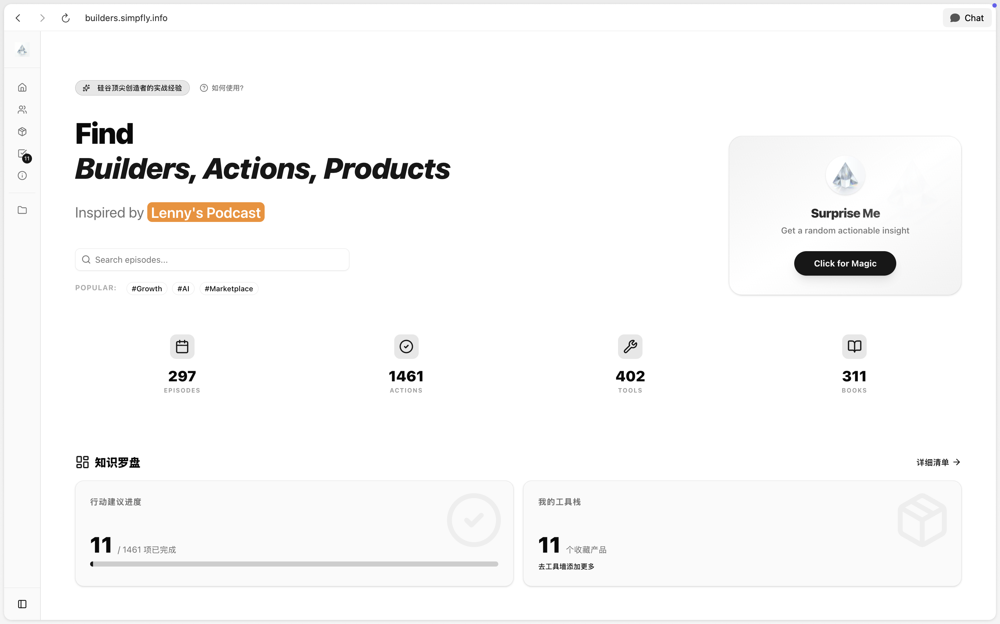
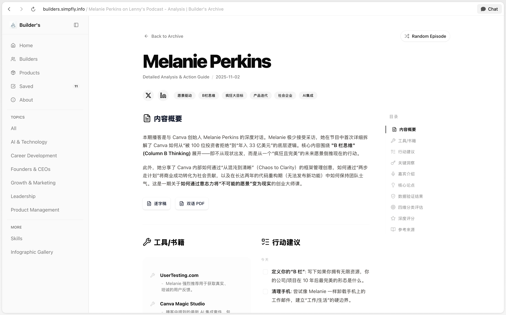
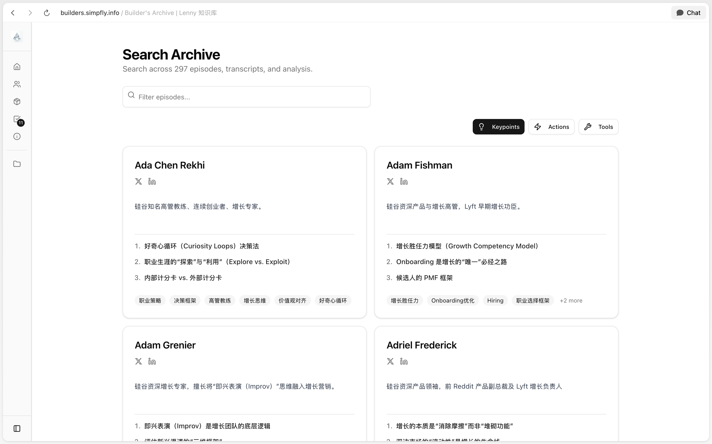
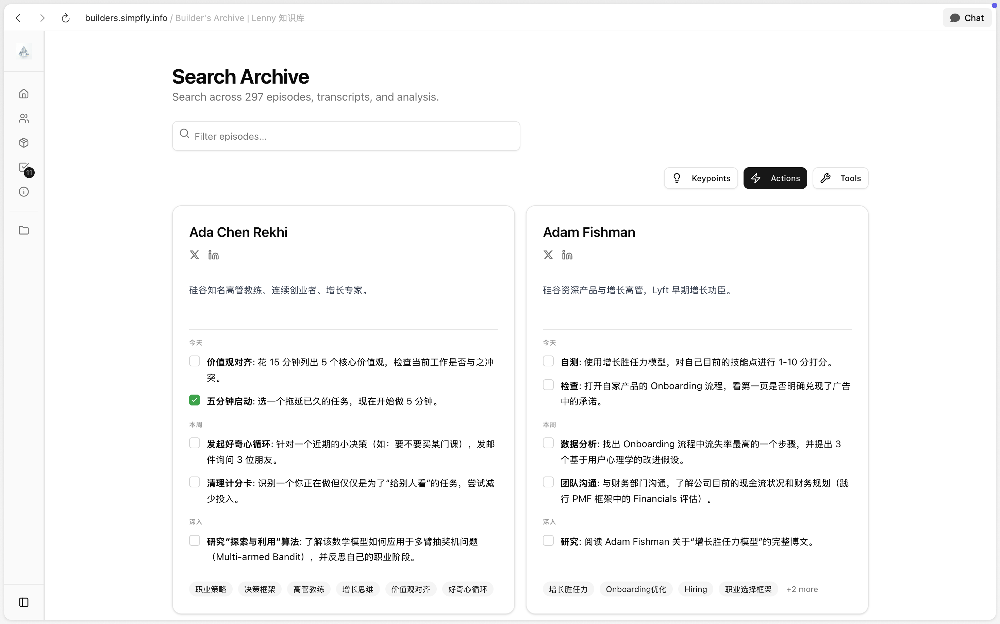
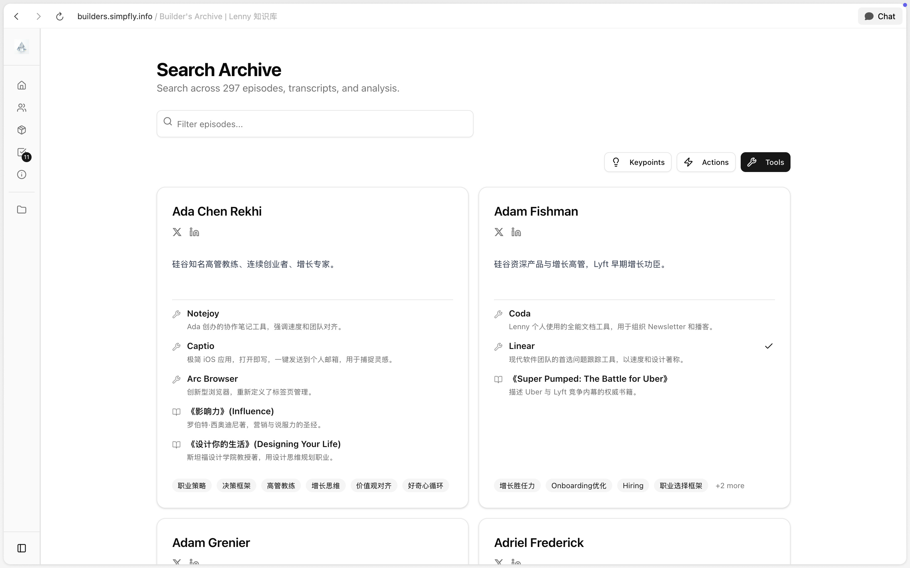
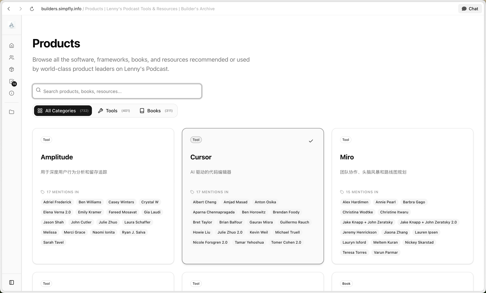
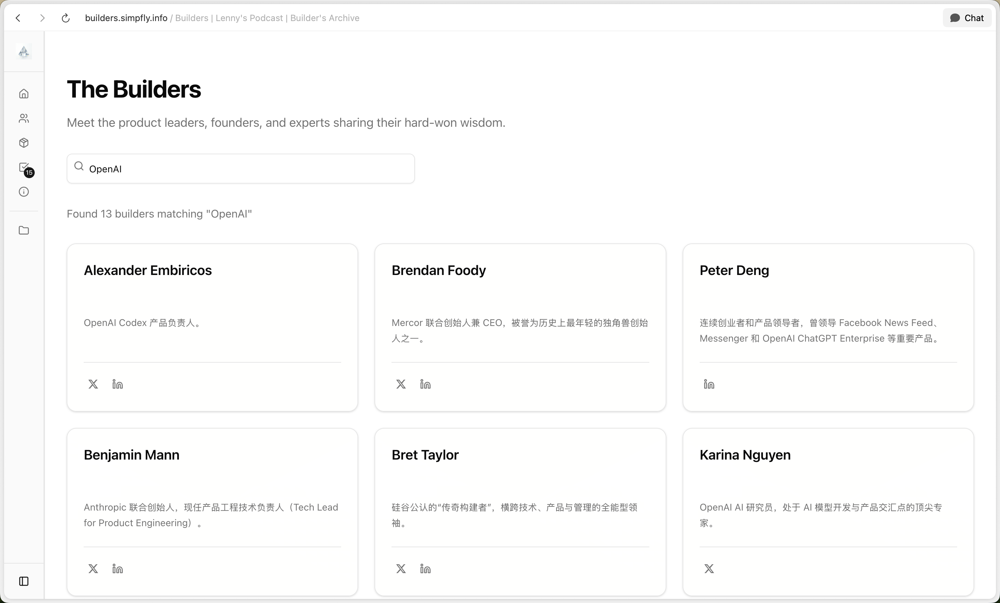
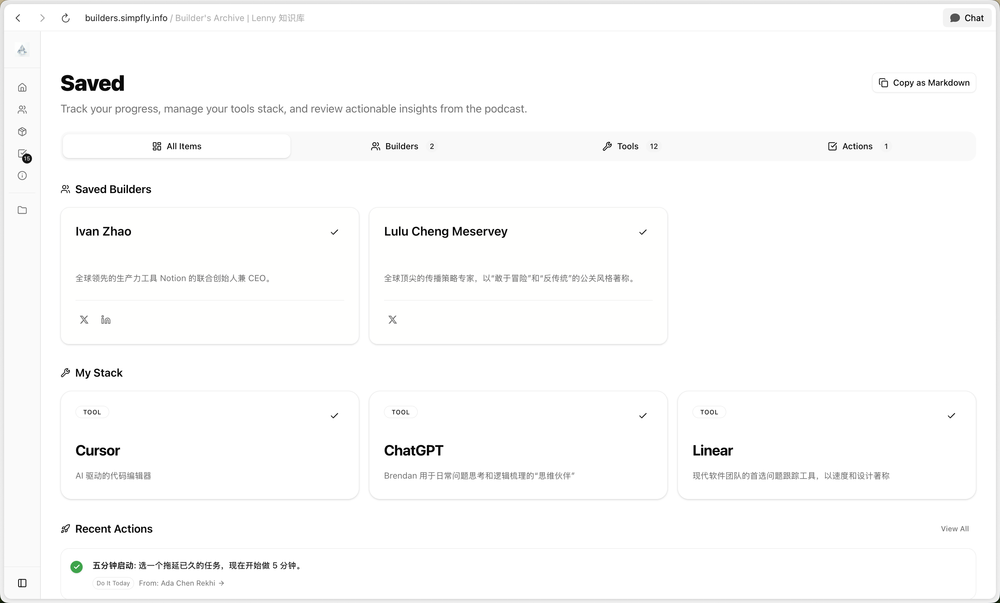

# Builder's Archive | Lenny 知识库

> 将 Lenny's Podcast 的深度洞察转化为**最小可做的行动 (Actionable Insights)**。

[](./web/content/episodes)
[](./web/content/episodes)
[](#致谢)

---

## 🌟 项目介绍

[Lenny's Podcast](https://www.lennyspodcast.com/) 是了解硅谷一线产品经理、增长黑客和创业者实战经验的绝佳来源。**Builder's Archive** 旨在通过 AI 深度解析，将 200+ 小时的访谈文稿转化为结构化的知识库。

把想法付诸实践是一个渐进的过程。我们通过重新设计交互，将信息解构为：

- **Actions**: 将洞察转化为 Checklist。
- **Products**: 提取访谈中提到的工具、书籍，搭建个人工具箱。
- **Builders**: 收录嘉宾简介与社交账号，关注一手信源。

---

## 📸 交互设计

### 首页与单集分析

<p align="center">
  
  
</p>

- **首页**：搜索框 + 热门话题标签 + 知识罗盘（行动进度/我的工具栈）。
- **单集详情**：内容概要、工具/书籍提取、行动建议清单，支持逐字稿阅读与 AI 对话。

### 多维度搜索与筛选

<p align="center">
  
  
  
</p>

- 支持 **Keypoints / Actions / Tools** 三种筛选模式，快速定位感兴趣的内容。

### Products & Builders

<p align="center">
  
  
</p>

- **Products**：汇总嘉宾推荐的工具与书籍，按提及次数排序。
- **Builders**：搜索嘉宾，查看其背景、社交账号与相关访谈。

### Saved 收藏夹

<p align="center">
  
</p>

- 将感兴趣的 Builders / Tools / Actions 保存到个人收藏夹，支持一键复制 Markdown。

---

## 🚀 快速开始

### Web UI (推荐)

项目已升级为基于 Next.js 的 Web 应用，提供更佳的阅读与检索体验。

```bash
cd web
npm install
npm run dev
```

访问 [http://localhost:3000](http://localhost:3000) 即可开始。

### 目录结构

```text
.
├── web/
│   ├── content/
│   │   ├── episodes/           # 核心内容：深度解析 (analysis.md) 与双语逐字稿
│   │   └── index/              # 话题索引 (产品、增长、领导力等)
│   └── public/
│       └── pdf-bilingual/      # 双语逐字稿 PDF 下载
├── pdf/                        # 深度分析报告 PDF 下载
└── README.md
```

---

## 🛠 如何使用

1.  **关键词检索**：在 Web 界面搜索感兴趣的关键词（如 "PMF", "Growth"），直达实战洞察。
2.  **收藏实践**：将感兴趣的实践、产品或嘉宾保存至 **Saved**，支持一键复制 Markdown。
3.  **与内容对话**：
    - 推荐配合 **Dia / ChatGPT Atlas** 阅读原文。
    - 将 `web/content/episodes/` 导入 AI 知识库，进行深度问答。

---

## 🍎 内容特色

### 深度解析 (`analysis.md`)

包含内容概要、核心话题、关键洞察（核心观点/金句/框架）、深度拆解以及**今日可行动**的清单。

### 双语逐字稿

完整英文原文与中文翻译对照，适合深度研究与专业英语学习。

---

## 🤝 致谢

本项目的诞生离不开以下贡献者的努力：

- **[Lenny Rachitsky](https://x.com/lennysan)**: 播客原作者，提供世界级的内容源。
- **[Penny777btc](https://github.com/Penny777btc/lenny-podcast-chinese)**: 中文深度解析的发起者与核心贡献者。
- **[simpfly](https://www.simpfly.info/about)**: 知识库 Web 界面制作与交互设计。

---

## 📝 免责声明

本仓库内容仅供学习和研究使用。所有访谈内容的版权归 Lenny's Podcast 及各位嘉宾所有。建议支持原创，订阅 [Lenny's Newsletter](https://www.lennysnewsletter.com/) 或关注其 [YouTube 频道](https://www.youtube.com/@LennysPodcast)。

---

## License

Educational use only. All rights reserved by original content creators.
